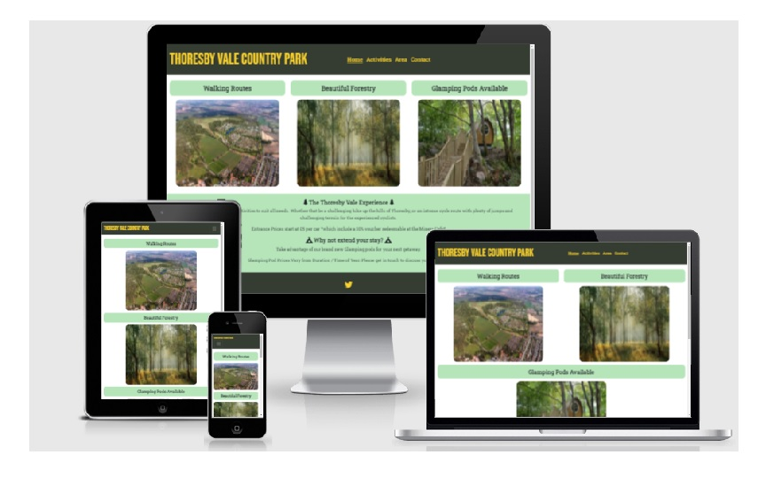
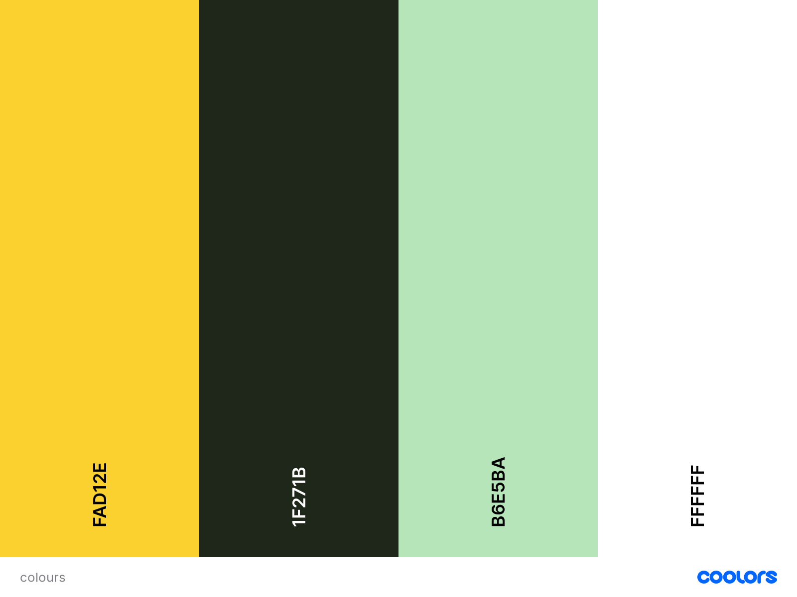
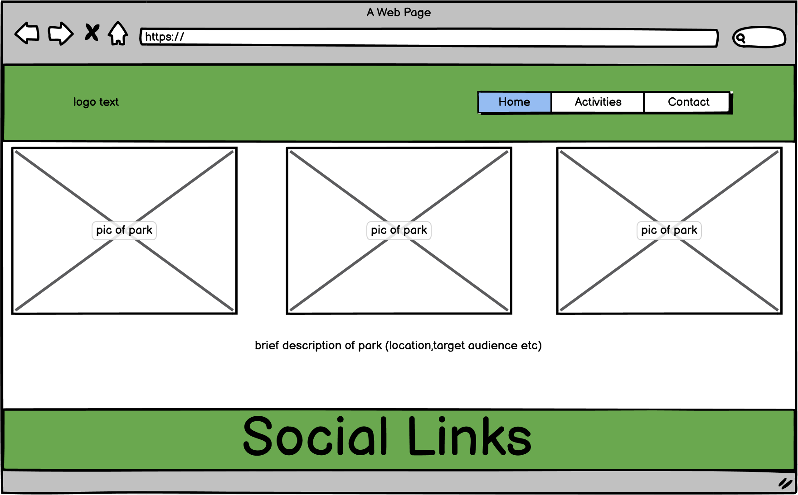
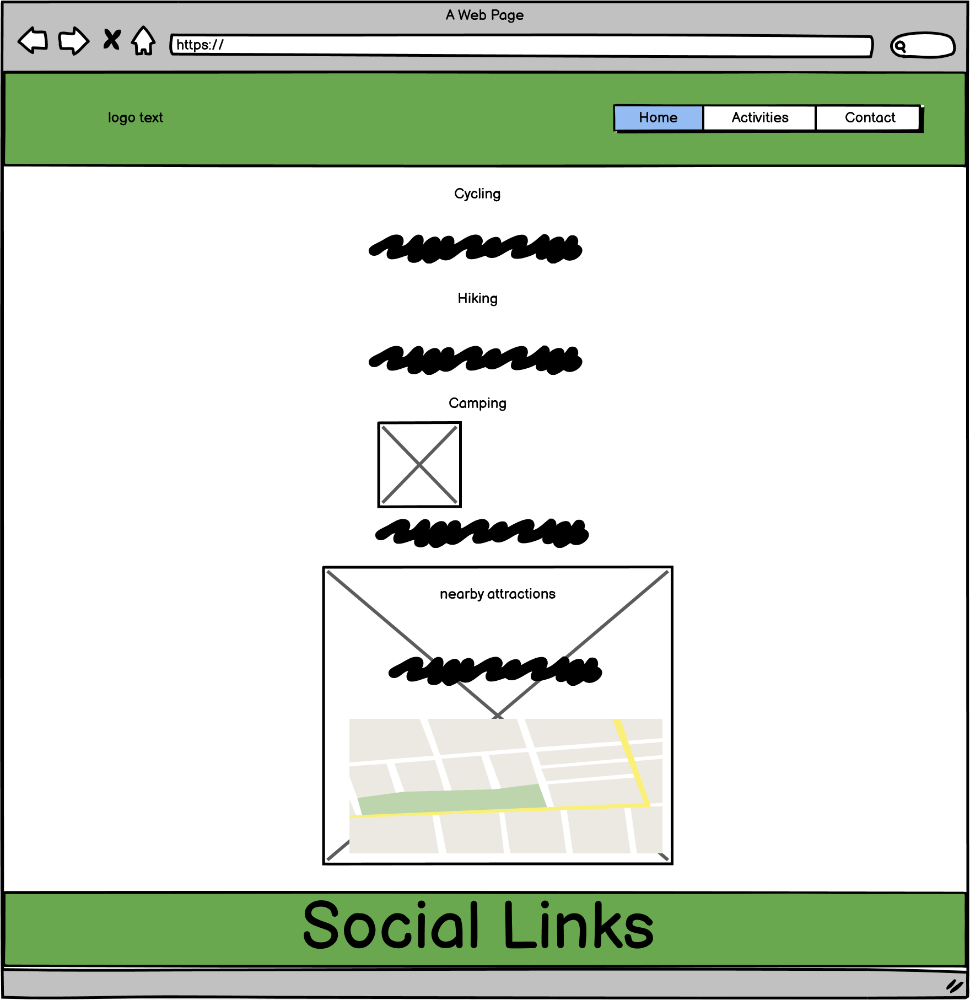
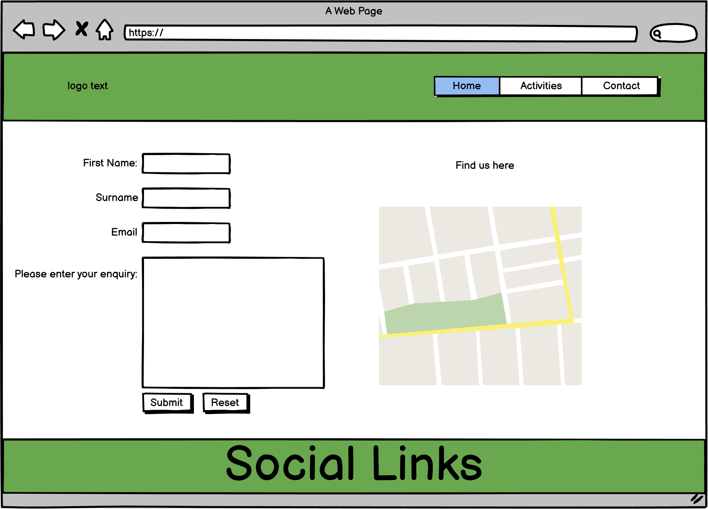

# Thoresby Vale Park

Thoresby Vale Country Park is my HTML/CSS static website project. This idea came from my own personal home town. The main purpose of this site is to advertise and inform site visitors of the park and the activities available, as well as providing an insight into the local surrounding area. The site is built to be responsive on all size devices. The contact form submit feedback currently loads the home page for the user.

## User Experience (UX)

As a first time user of this website, i want to quickly define the purpose of the site - being informed of the parks activities and the initial costing of entering and seeing some relative imagery.
I want to be able to navigate easily through the website with a simple functional Navigation to find extra information.
I want to be able to contact the park regards any further queries in the future.
I want a contact form so that i can ask any questions and/or book for a holiday.

## Design

### Colour Scheme

The site consists are four colours all nicely matched together using Coolors -

### Font

Main fonts used are "Roboto Slab" and "Bebas Neue" (Sans Serif as the back-up) these fonts compliment each other and provided a clean text look to my site. As this site is informative, clarity is key.
Source is Google Fonts.

### Imagery

All images used are relative to the content of the page. I have used several royalty free image providers.

### Layout

I have used Bootstraps grid system to build the core layout of the site. The landing page consists of relative imagery and minimal text to maintain and clean and tidy look.
Throughout the other pages of the site i have consistantly created boxes with a black border and green background to house the individual pages content.

### WireFrames

## Future Improvements

- Add JavaScript Carousel to home page for imagery of park to further reduce content on home page
- Contact form completions sent to external address
- Online booking service for glamping pod bookings

## Technologies

- HTML - providing the main structure and content of the site as well as providing key accessibility for all types of users.
- CSS - styling of the site. Bootstraps CSS and own custom CSS used.
- Bootstrap - mainly used for the responsive grid system and navigation.
- Google Fonts - 'Roboto Slab' & 'Bebas Neue' fonts imported from Google Fonts.
- Font Awesome - icons used relative to content. Used for footer social links.
- Balsamiq Wireframes - software used to create initial styling plan of website.
- Gitpod - IDE used to create site
- Git - used for version control in development of website which would then be pushed to GitHub
- GitHub - store of code from gitpod. responsible for deployment via GitHub Pages

## Testing & Validation

- HTML Validation (Source = W3C HTML Validator) = No errors
- CSS Validation (Source = W3C Jigsaw CSS Validator) = No errors
- Manual Testing done throughout project (Google Dev Tools - other devices once deployed)
- Bugs - All bugs and fixes are identified within the project commits to demonstrate stages of development when creating the site.

## Credits 

- My CI mentor Reuben Ferrante - who gave constructive improvement ideas and defined the project scope initially.
- Thoresby Vale Harworth Group - for supporting assets included in the site (image and video)
- Pixabay - for their gallery of royalty free images.
- Bootstrap - collection of responsive features
- W3Schools - learning aid when creating websites.