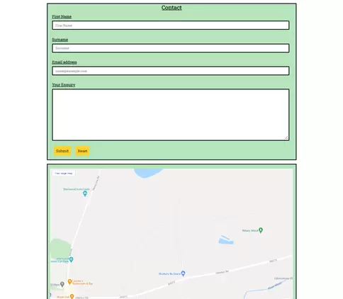
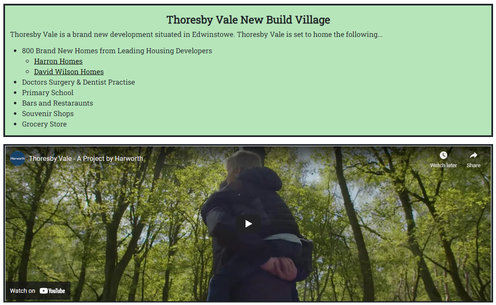

# Thoresby Vale Park

## Live Link - https://nsc15.github.io/thoresby_vale_park/

Thoresby Vale Country Park is my HTML/CSS static website project. This idea came from my own personal home town. The main purpose of this site is to advertise and inform site visitors of the park and the activities available, as well as providing an insight into the local surrounding area. The site is built to be responsive on all size devices. The contact form submit feedback currently loads the home page for the user.

## User Experience (UX)

As a first time user of this website, i want to quickly define the purpose of the site - being informed of the parks activities and the initial costing of entering and seeing some relative imagery.
I want to be able to navigate easily through the website with a simple functional Navigation to find extra information.
I want to be able to contact the park regards any further queries in the future.
I want a contact form so that i can ask any questions and/or book for a holiday.
Details of surrounding attractions and services to the park also detailed for the user.

## Design

### Colour Scheme

The site consists are four colours all nicely matched together using Coolors - these colours i feel were great at setting the theme of a countryside based service, whilst also maintaining a sleek website to keep site visitors engaged.

### Font

Main fonts used are "Roboto Slab" and "Bebas Neue" (Sans Serif as the back-up) these fonts compliment each other and provided a clean text look to my site. As this site is informative, clarity is key.
Source is Google Fonts.

### Imagery

All images used are relative to the content of the page. I have used several royalty free image providers. Images were vital to the customer audience of my site as it provides extra information and also advertises further the things on offer at the park and the surrounding areas, which being the park is a tourist attraction will prove beneficial.

### Layout

I have used Bootstraps grid system to build the core layout of the site. The landing page consists of relative imagery and minimal text to refrain from overloading the site visitor. The main design of the website is each section is seperated by content housings (green background and black border). This is consistant throughout all webpages. The reasoning behind this was in the hope that the chance of missing information will decrease rapidly, as id feel a webpage overloaded with descriptions all bunched together encourages skim reading. See below screenshots of webpage to provide an insight into the webpages layout - 

As seen here, each topic is seperated, in this case Cycling Routes, Hiking routes and the glamping pods. These are the main attractions to the park so this information is important.
### WireFrames
 - These wireframes were very basic in design in the initial stages. When going through the development i was quickly adapting the look and feel in Dev Tools and i found the further i got into the project the more i was deviating away. I dont see this as a negative but maybe a point to think about in future project planning.

## Features

- Responsive on all devices (down to 320px)
- HTML and CSS (Custom and Bootstrap Grid system and Nav) JS hamburger nav function (Bootstrap)
- Contact Form with required input (current send feedback is sending back to homepage)
 - 

- Supporting video content controlled by the site user

 - 
- Responsive navigation for mobile users
- Google map links to relatable locations

## Future Improvements

- Add JavaScript Carousel to home page for imagery of park to further reduce content on home page
- Contact form completions sent to external email address
- Online booking service for glamping pod bookings

## Technologies

- HTML - providing the main structure and content of the site as well as providing key accessibility for all types of users.
- CSS - styling of the site. Bootstraps CSS and own custom CSS used.
- Bootstrap - mainly used for the responsive grid system and navigation.
- Google Fonts - 'Roboto Slab' & 'Bebas Neue' fonts imported from Google Fonts.
- Font Awesome - icons used relative to content. Used for footer social links.
- Balsamiq Wireframes - software used to create initial styling plan of website.
- Gitpod - IDE used to create site
- Git - used for version control in development of website which would then be pushed to GitHub
- GitHub - store of code from gitpod. responsible for deployment via GitHub Pages

## Testing & Validation

- HTML Validation (Source = W3C HTML Validator) = No errors
- CSS Validation (Source = W3C Jigsaw CSS Validator) = No errors
- Dev Tools used throughout project build to add styling in real time before commit to main code.
- Dev Tools also was a key tool in the process of making the site responsive down to 320px width.
- Bugs - All bugs and fixes are identified within the project commits to demonstrate stages of development when creating the site.
- Changes - This is my first project, you will see within the code commits and the wireframes that as the project was being built different design ideas were implemented going away from the original design.
- Devices - Once site was deployed i spent time going through the site on different devices sizes to test everything was responsive the way i wanted it to be.

### Bugs 

- Nav Bar hamburger dropdown not functioning - bootstraps js script wasnt linked into the HTML documents by mistake, once added the responsive navigation was working correctly.
- Home page images werent responsive as they werent stacking on top of each other at different breakpoints - removed initial sizings added to pictures as these were overiding the bootstrap grid system. Width 100% allowed images to just take column width sizing.
- bugs in code - class names overiding bootstrap classes e.g grid system = container,row,col then my own classes added aswell however i had disregarded these classes and essentially created my own class completely. Removed all of these errors from code.
- Google maps Iframes not allowing map movement - removed internal padding from map id. created a map class and used for both activities.html and contact.html google map iframes - both now working correctly and allow the user to move to different locations of the map.
- Area.html bottom image sizes loading different on different devices sizes - added media query to adjust height sizing at 768px -below loads auto sizing as columns are stacked at this breakpoint then above 768 loads 50vh to match robin hood image while maintaining a good aspect ratio.

Any other bugs can be found within the commit development stages.

## Credits 

- My CI mentor Reuben Ferrante - who gave constructive improvement ideas and defined the project scope initially.
- Thoresby Vale Harworth Group - for supporting assets included in the site (image and video)
- Pixabay - for their gallery of royalty free images.
- Bootstrap - collection of responsive features
- W3Schools - learning aid when creating websites.